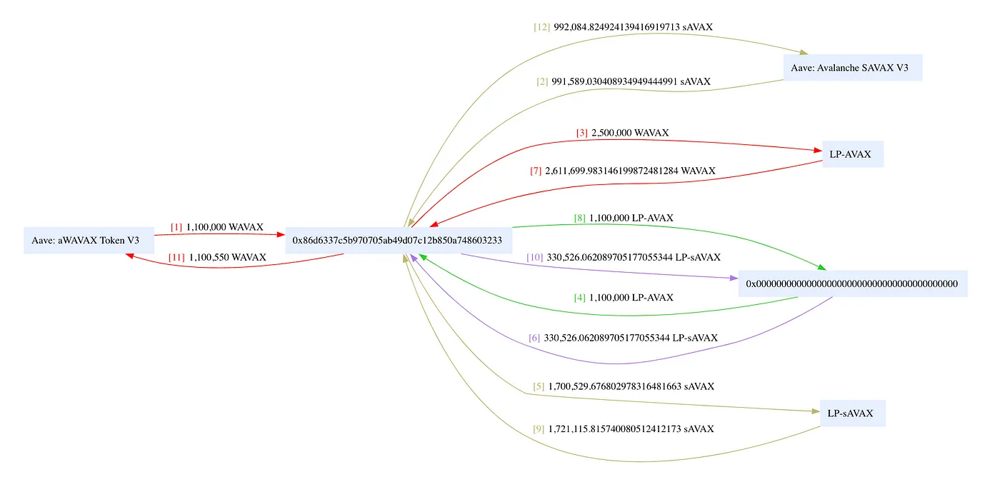

## TL;DR

On October 12, 2023, Platypus Finance was exploited due to a smart contract vulnerability, which resulted in a loss of funds worth approximately $2.2 million.

## Introduction to Platypus Finance

Platypus Finance is a single-side AMM designed for exchanging stable cryptocurrencies on the Avalanche blockchain.

## Vulnerability Assessment

The root cause of the exploit is due to swap slippage manipulation.

### Steps

**Step 1:**

We attempt to analyze [one of the attack transactions](https://explorer.phalcon.xyz/tx/avax/0xab5f6242fb073af1bb3cd6e891bc93d247e748a69e599a3744ff070447acb20f) executed by [the exploiter](https://snowtrace.io/address/0x0cd4fd0eecd2c5ad24de7f17ae35f9db6ac51ee7).

**Step 2:**

The swap slippage in [Platypus](https://snowtrace.io/address/0xe5c84c7630a505b6adf69b5594d0ff7fedd5f447#code) depends on the convergence of the coverage cash liquidity ratio in the asset contract.

```solidity
/**
 * @notice Quotes the actual amount user would receive in a swap, taking in account slippage and haircut
 * @param fromAsset The initial asset
 * @param toAsset The asset wanted by user
 * @param fromAmount The amount to quote
 * @return actualToAmount The actual amount user would receive
 * @return haircut The haircut that will be applied
 */
function _quoteFrom(Asset fromAsset, Asset toAsset, uint256 fromAmount) private view returns (uint256 actualToAmount, uint256 haircut) {
  uint256 idealToAmount = _quoteIdealToAmount(fromAsset, toAsset, fromAmount);
  require(toAsset.cash() >= idealToAmount, "INSUF_CASH");

  uint256 slippageFrom = _slippage(_slippageParamK, _slippageParamN, _c1, _xThreshold, fromAsset.cash(), fromAsset.liability(), fromAmount, true);
  uint256 slippageTo = _slippage(_slippageParamK, _slippageParamN, _c1, _xThreshold, toAsset.cash(), toAsset.liability(), idealToAmount, false);
  uint256 swappingSlippage = _swappingSlippage(slippageFrom, slippageTo);
  uint256 toAmount = idealToAmount.wmul(swappingSlippage);
  haircut = _haircut(toAmount, _haircutRate);
  actualToAmount = toAmount - haircut;
}
```

**Step 3:**

The attacker was able to manipulate the cash and liability in the contract to gain a handful of incentives from this swap slippage manipulation.

```solidity
/**
  * @notice Yellow Paper Def. 2.5 (Swapping Slippage). Calculates 1 - (Si - Sj).
  * Uses the formula 1 + (-Si) - (-Sj), with the -Si, -Sj returned from _slippage
  * @dev Adjusted to prevent dealing with underflow of uint256
  * @param si -si slippage parameter in WAD
  * @param sj -sj slippage parameter
  * @return The result of swapping slippage (1 - Si->j)
  */
function _swappingSlippage(uint256 si, uint256 sj) internal pure returns (uint256) {
    return WAD + si - sj;
}
```

**Step 4:**

The attacker initially took a flash loan of wrapped assets in AVAX and then deposited WAVAX to the LP-AVAX contract and sAVAX to the LP-sAVAX contract, thereby increasing the liability of both LP contracts.



**Step 5:**

The exploiter then swapped sAVAX to WAVAX to reduce the cash from the LP-AVAX contract, and then proceeded to withdraw WAVAX from LP-AVAX to remove all available cash from the LP-AVAX contract.

**Step 6:**

This caused an increase in the `slippageFrom` value, which is the first parameter in the `_swappingSlippage` function, which resulted in the manipulation of the `actualToAmount` in the `_quoteFrom` function. The attacker then swapped the underlying assets to take away a huge profit from this manipulated slippage.

**Step 7:**

According to [reports](https://twitter.com/BlockSecTeam/status/1712445197538468298), one of the attackers made a mistake, which was [immediately hijacked](https://twitter.com/SupremacyHQ/status/1712649057943093381) to recover [50k sAVAX and 7k AVAX](https://twitter.com/Platypusdefi/status/1712513975689294062), totaling approximately $575,000.

## Aftermath

Following the occurrence of the exploit, the [team stated](https://twitter.com/Platypusdefi/status/1712365385100689584) that they had taken proactive measures to temporarily suspend all of their pools.

A [later tweet](https://twitter.com/Platypusdefi/status/1712513974124818589) by the team reported that the exploit was targeted on sAVAX-AVAX poo, which saw a loss of approximately $2.2 million, out of which approximately $567,000 [were recovered](https://twitter.com/Platypusdefi/status/1712513975689294062).

According to the team, they will be working closely with [security experts](https://twitter.com/Platypusdefi/status/1712513977371279762) to identify and rectify these vulnerabilities before resuming pool operations.

## Solution

Addressing the exploit in Platypus Finance requires a thorough review and restructuring of the platform’s security protocols, starting with an exhaustive audit of the existing smart contract. The focus should be on the functions related to asset swapping, slippage calculations, and liquidity pool management, ensuring they accurately handle asset values and slippages even in the event of potential manipulative actions.

In addition to refining existing functions, the platform must implement enhanced slippage protection measures. This involves setting a maximum allowable slippage rate for trades and introducing stricter controls on the cash-to-liability ratios in liquidity pools. With these controls in place, the system can prevent trades that would result in excessive, manipulated slippage, safeguarding users’ funds even if attackers alter the cash or liability parameters.

_This article was [originally published](https://medium.com/p/64a3dd0bfd76) by Pukar Acharya elsewhere._
