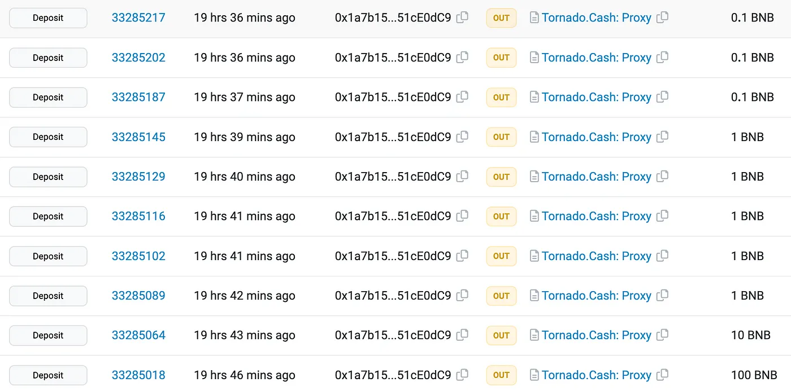

## TL;DR

On November 6, 2023, TrustPad was exploited on the BNB Chain due to a smart contract vulnerability, which resulted in a loss of 615.03 BNB, worth approximately $152,000.

## Introduction to TrustPad

TrustPad is a decentralized multi-chain fundraising platform that enables projects to raise capital.

## Vulnerability Assessment

The root cause of the exploit is due to multiple design flaws within its staking contracts. Essentially, the attacker was able to harvest the pending rewards by manipulating the lock period via an untrusted external call.

### Steps

**Step 1:**

We attempt to analyze [one of the attack transactions](https://bscscan.com/tx/0x191a34e6c0780c3d1ab5c9bc04948e231d742b7d88e0e4f85568d57fcdc03182) executed by [the exploiter](https://bscscan.com/address/0x1a7b15354e2f6564fcf6960c79542de251ce0dc9).

**Step 2:**

The attacker initially deposited TPAD tokens into the vulnerable [LaunchpadLockableStaking contract](https://bscscan.com/address/0x129f4ac88b0446f9b46b176c93531e6cf4687657) using the [receiveUpPool function](https://bscscan.com/address/0x129f4ac88b0446f9b46b176c93531e6cf4687657#code#F23#L506), which allowed them to control the newLockStartTime state of the contract.

```solidity
function receiveUpPool(address account, uint256 amount) external {
  require(account != address(0), "Must specify valid account");
  require(amount > 0, "Must specify non-zero amount");

  UserInfo storage user = userInfo[account];

  // Re-lock (using old date if already locked)
  // With lock start == block.timestamp, rewardDebt will be reset to 0 - marking the new locking period rewards countup.
  uint256 newLockStartTime;
  if (isLocked(account)) {
    newLockStartTime = depositLockStart[account];
  } else {
    newLockStartTime = LaunchpadLockableStaking(msg.sender).isLocked(account) ? LaunchpadLockableStaking(msg.sender).depositLockStart(account) : block.timestamp;
  }
  updateDepositLockStart(account, newLockStartTime);
  emit Locked(account, amount, lockPeriod, 0);

  // Transfer deposit
  liquidityMining.stakingToken.safeTransferFrom(msg.sender, address(this), amount);

  stakersCount += user.lastStakedAt > 0 ? 0 : 1;
  user.amount += amount;
  user.lastStakedAt = block.timestamp;
  lastClaimedAt[account] = block.timestamp;

  emit Deposit(account, amount, 0);

  if (address(secondaryStaking) != address(0)) {
    secondaryStaking.deposit(amount);
  }
}
```

**Step 3:**

In this receiveUpPool function, if the account is not locked, the depositLockStart time will be set. The attacker is then able to manipulate it to immediately deposit and withdraw to accumulate the pending rewards.

```solidity
function isLocked(address account) public view override returns (bool) {
  return block.timestamp < depositLockStart[account] + lockPeriod;
}
```

**Step 4:**

As a result, the attacker is able to instantly withdraw all staked amounts and elevate the pending reward state by calling the withdraw function of the contract.

```solidity
function withdraw(uint256 amount) external override notMigrated {
  address account = msg.sender;
  UserInfo storage user = userInfo[account];
  bool tokensLocked = isLocked(account);
  uint256 fee;

  require(allowEarlyWithdrawal || !tokensLocked, "Account is locked");
  require(user.amount >= amount, "Withdrawing more than you have!");

  if (address(secondaryStaking) != address(0)) {
    try secondaryStaking.withdraw(amount) {} catch {}
  }

  updateUserPending(account);

  if (amount > 0) {
    user.amount -= amount;
    user.lastUnstakedAt = block.timestamp;
    stakersCount -= user.amount == 0 && stakersCount > 0 ? 1 : 0;

    // Collect fee if tokens are locked and we allow early withdrawal
    if (allowEarlyWithdrawal && tokensLocked) {
      (amount, fee) = takeFee(amount, fees.withdrawFee, fees.collectorAddress);
      fees.collectedWithdrawFees += fee;
    }

    // Transfer withdrawal
    liquidityMining.stakingToken.safeTransfer(address(account), amount);
  }

  updateUserDebt(account);
  emit Withdraw(account, amount, fee, tokensLocked);
}
```

**Step 5:**

These steps were repeated multiple times, following which the attacker invoked a call to the stakePendingRewards function.

The stakePendingRewards function also allowed the attacker to transform the accumulated pending rewards into staked amounts, letting the attacker withdraw the staking rewards as TPAD tokens in later transactions and sell the tokens for profit.

```solidity
function stakePendingRewards() external notMigrated {
  address account = msg.sender;
  UserInfo storage user = userInfo[account];
  //        require(isRewardMatured(account), 'Rewards are not matured yet');

  updateUserPending(account);
  uint256 amount = user.pendingRewards;
  user.pendingRewards = 0;
  user.amount += amount;

  if (!isLocked(account)) {
    depositLockStart[account] = block.timestamp;
    user.rewardDebt = 0;
    emit Locked(account, amount, lockPeriod, 0);
  }

  updateUserDebt(account);

  if (address(secondaryStaking) != address(0)) {
    secondaryStaking.deposit(amount);
  }

  emit StakedPending(account, amount);
}
```

**Step 6:**

Finally, the attacker withdrew all parts of their profits and swapped them for 615 BNB worth approximately $152,000.

**Step 7:**

The attacker has already laundered all of these stolen funds into Tornado Cash.


## Aftermath

The [team acknowledged](https://twitter.com/TrustPad/status/1721582197910430106) the occurrence of the exploit in one of their [staking contracts](https://twitter.com/TrustPad/status/1721628017133576239) and stated that it has been investigating the issue. They urged users to avoid buying or selling TPAD tokens. They [further communicated](https://twitter.com/TrustPad/status/1721953601181106344) that an official post-mortem report and summary of the event announcements would be shared promptly.

## Solution

To effectively safeguard a DeFi protocol like TrustPad against exploits, a comprehensive approach must be adopted that intertwines smart contract audits with robust security practices. This strategy starts with meticulous code audits conducted by seasoned auditors who delve into the smart contracts line by line, complemented by formal verification processes that mathematically validate the correctness of the contracts’ logic. Furthermore, the application of automated security tools is imperative; these tools should be integrated into the continuous integration and delivery pipeline to preemptively catch common vulnerabilities.

Adding time-locked features to contract upgrades is another important part of the prevention strategy. This creates a buffer period for finding and fixing any unwanted effects of code changes. Additionally, limiting the amount of funds or the volume of transactions that a contract can handle can significantly reduce the risk profile of the protocol. It is also essential to design smart contracts with the capability to be paused or shut down in case of an emergency, with these functions controlled by a combination of multi-signature wallets and decentralized governance to prevent abuse.

The due diligence aspect is a critical component of safeguarding investments in DeFi protocols. Users and investors must be encouraged to conduct their own thorough research before committing funds to any project. This involves scrutinizing the project’s whitepaper, understanding the team’s background and track record, and reviewing the results of any smart contract audits that have been made public. Due diligence also includes monitoring the community’s sentiment and the responsiveness of the project’s developers to security concerns.

_This article was [originally published](https://medium.com/p/642bc2c0667e) by Pukar Acharya elsewhere._
