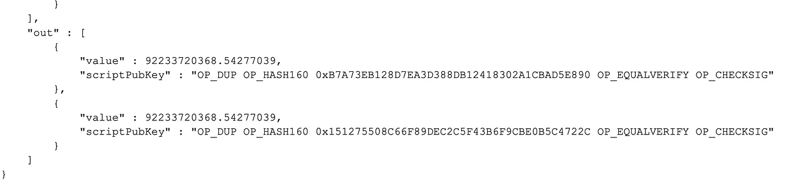

## TL;DR

On August 15, 2010, an anonymous hacker exploited a critical vulnerability in Bitcoin, allowing them to generate 184.467 billion Bitcoin.

## Introduction to Bitcoin

Bitcoin is the first decentralized cryptocurrency that was created in 2009 by an unknown person or group of people using the pseudonym Satoshi Nakamoto.

## Vulnerability Assessment

The root cause of the incident is a value overflow bug.

### Attack Explained

The total supply of Bitcoin is [famously limited](https://decrypt.co/34876/why-is-bitcoins-supply-limit-set-to-21-million) to 21 million BTC tokens. However, in an extraordinary breach of this limit, a hacker managed to create an amount of bitcoins that was 8,784 times greater than this cap.

This occurred in block 74,638, where a single transaction astonishingly generated about 184.4 billion bitcoins (precisely 184,467,440,737.09551616 BTC), distributing them across three different addresses. Notably, two of these addresses each received a staggering 92.2 billion bitcoins (exactly 92,233,720,368.54277039 BTC).

The incident revealed that the hackers had managed to create bitcoins in a manner that defied the [established rules](https://nvd.nist.gov/vuln/detail/CVE-2010-5139) of the Bitcoin network.

This was due to a gap in the code responsible for verifying transactions; it failed to handle output values so large they caused an overflow when added together.

This oversight was first noticed by Jeff Garzik, now co-founder and CEO of Bloq, who brought it to attention on the [BitcoinTalk forum](https://bitcointalk.org/index.php?topic=822.0), labeling it an [‘overflow bug’](https://bitcointalk.org/index.php?topic=823.0). In response, Satoshi Nakamoto, in collaboration with other developers, swiftly [engineered a solution](https://github.com/bitcoin/bitcoin/commit/d4c6b90ca3f9b47adb1b2724a0c3514f80635c84#diff-118fcbaaba162ba17933c7893247df3aR1013). Within three hours of the incident being reported, and five hours from its occurrence, a fix was issued in Bitcoin [version 0.3.1](https://bitcointalk.org/index.php?topic=823.msg9573&ref=hackernoon.com#msg9573).

A soft fork was swiftly implemented, resetting the Bitcoin blockchain to a state prior to the exploited block. This update included code modifications to reject transactions with output value overflows, effectively removing them and reverting the blockchain to an earlier, uncompromised state. This reorganization was significant, encompassing 53 blocks, a scale never seen before in Bitcoin’s history.

In the immediate aftermath, two versions of the Bitcoin blockchain existed. Satoshi Nakamoto, the pseudonymous creator of Bitcoin, closely monitored these competing chains, urging miners to support the corrected version to expedite its dominance.

Approximately 19 hours after the incident, the corrected chain prevailed. The erroneous chain persisted briefly, causing some disruptions, until it was surpassed at block 74,691, establishing the corrected chain as the definitive Bitcoin blockchain that everyone uses today.

## Aftermath

Despite the magnitude of the exploit, Bitcoin’s market value remained resilient. In fact, in 2010, following the soft fork and patch, Bitcoin’s price witnessed a significant increase of over 300%, soaring from $0.07 to $0.30 by year’s end. This rapid and effective response likely played a crucial role in restoring trust and integrity in Bitcoin, a relatively untested concept at the time. The bitcoins created in the exploit were effectively nullified in the corrected blockchain through the reorganization.

To date, the identity of the individual responsible for this exploit remains a mystery.

_This article was [originally published](https://medium.com/p/a59631a9dc04) by Pukar Acharya elsewhere._
