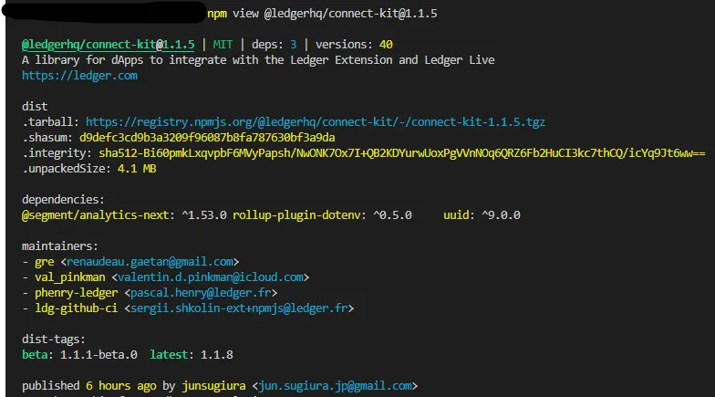
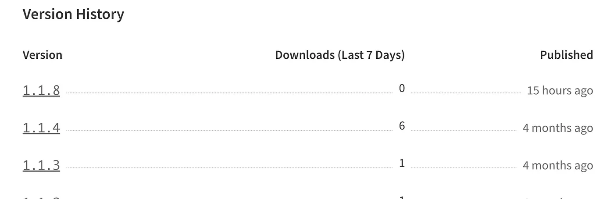
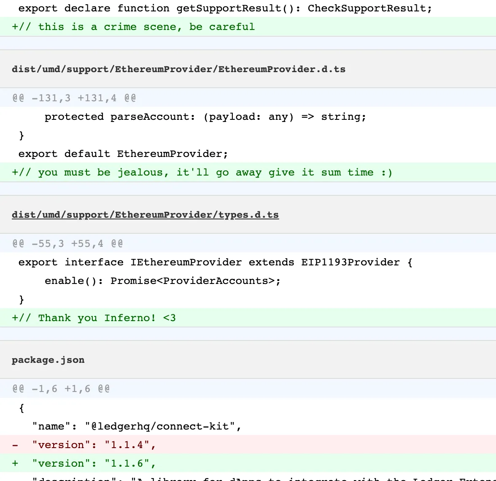

## TL;DR

On December 14th, 2023, Ledger encountered a significant security breach targeting Ledger Connect Kit, a Javascript library to connect websites with wallets, leading to a large-scale supply chain attack affecting numerous dApps, causing a loss of assets worth over $610,000.

## Introduction to Ledger

Ledger provides a wallet solution designed for storing and managing cryptocurrency assets.

## Attack Explained

The orchestrator of this exploit was a former Ledger employee who had reportedly fallen victim to a phishing attack. This unfortunate incident granted malicious actors access to the employee’s NPMJS account, a package manager for JavaScript-based libraries. Subsequently, the attackers uploaded and published malicious files within the Ledger Connect Kit.



Ledger utilized a Content Delivery Network (CDN) to distribute its JavaScript library. Unfortunately, they loosely specified dependencies and [did not lock the version](https://github.com/LedgerHQ/connect-kit/blob/main/packages/connect-kit-loader/src/index.ts#L83) of the loaded JavaScript files. The code snippet below illustrates this aspect:

```javascript
export async function loadConnectKit(): Promise<LedgerConnectKit> {
  const src = "https://cdn.jsdelivr.net/npm/@ledgerhq/connect-kit@1";
  const globalName = "ledgerConnectKit";

  return new Promise((resolve, reject) => {
    const scriptId = `ledger-ck-script-${globalName}`;

    // we don't support server side rendering, reject with no stack trace for now
    if (typeof document === "undefined") {
      reject("Connect Kit does not support server side");
      return;
    }

    if (document.getElementById(scriptId)) {
      resolve((window as { [key: string]: any })[globalName]);
    } else {
      const script = document.createElement("script");
      script.src = src;
      script.id = scriptId;
      script.addEventListener("load", () => {
        resolve((window as { [key: string]: any })[globalName]);
      });
      script.addEventListener("error", (e) => {
        reject(e.error);
      });
      document.head.appendChild(script);
    }
  });
}
```

Let’s understand this part of the code from the above function -

```javascript
const src = "https://cdn.jsdelivr.net/npm/@ledgerhq/connect-kit@1";
```

The ‘src’ variable pointed to a CDN [provided by jsDelivr](https://cdn.jsdelivr.net/npm/@ledgerhq/connect-kit@1), fetching `version 1` of the @ledgerhq/connect-kit package from the npm registry. This means the above library as well as [`@ledgerhq/connect-kit-loader`](https://github.com/LedgerHQ/connect-kit/blob/main/packages/connect-kit-loader/src/index.ts#L83) allow dApps to load the associated package at runtime from a CDN. While this approach allowed web applications to retrieve the package from a CDN for enhanced performance and reliability, it introduced a critical security flaw.

Ledger’s rationale behind this approach was to expedite logic and UI improvements without necessitating wallet libraries and dApps to update their package versions and release new builds. However, this convenience came at the expense of security since it failed to restrict the version of the package being fetched.

Consequently, even [organizations implementing stringent security practices](https://sourcegraph.com/search?q=context%3Aglobal+%40ledgerhq%2Fconnect-kit&patternType=standard&sm=1&groupBy=repo) and locking the package loader version remained vulnerable. The core source file hosted by Ledger perpetually relied on the latest version of the connect-kit package, from >=1.0.0 to <2.0.0. This oversight permitted attackers to infiltrate all protocols employing the connect-kit package.

This approach posed an extraordinary threat, compromising decentralization and security by introducing an element of trust. The impacted packages placed unwavering trust in whatever the CDN published or upgraded within the library. In the event of a compromised package, all downstream dApps employing it were left defenseless, devoid of any safeguards.

It is noteworthy that the Ledger team has been [directly publishing upgrades](https://github.com/LedgerHQ/connect-kit/pull/30#issuecomment-1856011665) to NPM without corresponding updates to their GitHub-based repositories. Remarkably, three releases of this package — v1.1.5, v1.1.6, and v1.1.7 — contained malicious code.

Consequently, even though Ledger had [never officially released](https://www.npmjs.com/package/@ledgerhq/connect-kit?activeTab=versions) any of these compromised versions, a phished credential was all the attackers needed to smoothly serve the tainted package via the CDN, effectively distributing it to all entities utilizing the package.



The attacker also added random comments throughout the code base.



The compromised versions were equipped with a [malicious drainer](https://gist.github.com/myrdyr/c2c2e50549b0c409ac424ef2580a4778) that deceived users into authorizing malicious transactions, essentially pilfering various tokens and currencies across [multiple decentralized exchanges (DEXs)](https://gist.github.com/myrdyr/c2c2e50549b0c409ac424ef2580a4778#file-stage1-js-L2833).

## Solution

In response to the recent supply chain attack on Ledger, it is imperative to proactively implement robust security measures to safeguard both organizations and users within the cryptocurrency ecosystem. These measures are aimed at preventing similar incidents and fortifying the integrity of the supply chain.

First and foremost, stringent access management policies must be embraced by organizations, including Ledger. Regularly reviewing and revoking access from former employees should be part of a comprehensive offboarding process that includes the disabling of all access points to sensitive systems. This proactive step prevents unauthorized access and the potential misuse of credentials.

Another vital security measure involves transitioning away from reliance on third-party Content Delivery Networks (CDNs) in favor of self-hosting critical resources. Self-hosting affords greater control over asset distribution and integrity, effectively reducing the risk of malicious interference through CDN vulnerabilities.

Developers and organizations must exercise diligence when integrating external code or dependencies. Instead of blindly loading code, it is imperative to adopt practices such as version pinning and checksum verification to ensure the integrity of imported libraries. Such practices guarantee that the code being utilized aligns with the expected and secure version.

To foster trust within the cryptocurrency community, consideration should be given to open-sourcing code. This commitment to transparency not only facilitates community-driven scrutiny but also encourages responsible vulnerability disclosure. Open-source practices empower the community to collectively identify and address security concerns, bolstering overall security.

To further enhance security, robust code review and deployment protocols should be established. This includes implementing “2 man rules” for code review and deployment, a process that requires multiple individuals to approve and oversee critical procedures. These protocols introduce checks and balances, reducing the risk of unauthorized or insecure code alterations.

In parallel, users must actively engage in securing their cryptocurrency assets. Properly verifying transactions on hardware wallets before signing them is imperative. This precautionary measure allows users to confirm the legitimacy of transactions and ensures that they do not inadvertently authorize malicious activities.

Lastly, it is essential to actively encourage and incentivize security reviews and vulnerability disclosures within organizations. This proactive approach can lead to the identification and mitigation of security vulnerabilities before they can be exploited. Recognizing and rewarding individuals who contribute to strengthening security fosters a culture of vigilance and collective responsibility.

_This article was [originally published](https://medium.com/p/3d91d0acd68f) by Pukar Acharya elsewhere._
